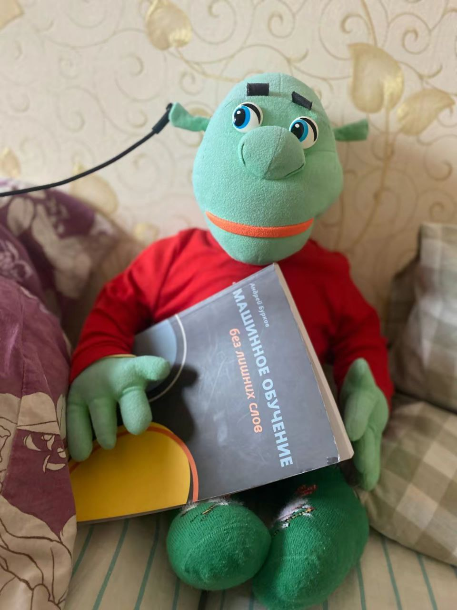

# 📖 A few days ago I finished reading a 100-page book on machine learning by Andrey Burkov, and this review is my personal opinion about it.

## 👍 The book is good, not great, but good. It is not suitable for absolute beginners, but if this is your second or third book on machine learning or you have taken 1-2 courses with writing machine learning code or you have experience in Kaggle competitions, then this book may be useful for you.

## 📄 Chapters 4-6 are excellent, all the math is well explained, all the theory is precise, and most machine learning interviews will ask you exactly the theory questions from these chapters.

### 📃 Chapter 4 is about the gradient descent algorithm, a very important optimization algorithm in machine learning. I studied this algorithm in my 5th semester at university, we solved math problems using this algorithm to find the minimum of various functions with approximations.

### 📃 Chapter 5 is the most important chapter in this book and is explained brilliantly. It covers feature engineering, binning, gap filling, algorithm selection in different situations, train-val-test split, underfitting and overfitting, regularization, metrics, hyperparameter tuning and cross-validation.

###📃  Chapter 6 is about neural networks and CNNs (also a bit about RNNs but RNNs are explained very briefly)

### 📃 Personally, I also liked the first part of subsection 9.2 about K-means, DBSCAN and HDBSCAN algorithm, they are explained very well.

## Now let's discuss the pros and cons of this book:
**Pros:**
+ ➕ The book is short (around 170 pages) and is good for preparing for an interview 2-3 days before. **This book helped me get an offer for a Data Scientist Internship position at Sunmait Technologies**

+ ➕ Chapters 4-6 are excellent and really enjoyable to read.

+ ➕ There are a lot of good images that explain the text and help readers understand the algorithms better

+ ➕ Each chapter has something interesting and useful, so I can't say you shouldn't read this book completely, just take your time and find the nuggets of gold.

Now for the cons:
- ➖ There is almost no code, only 2-3 subsections have small code snippets.
- ➖ 50% (mostly in chapters 7-10) of the mathematical formulas just appear in the text with insufficient explanation and without enough preparation for the reader, so only experienced ML engineers and math graduates can read all the formulas without much difficulty. For the rest, I just recommend using ChatGPT or Grok to understand all the complex formulas.
- ➖ subsections 7.8-7.11 should be replaced by adding pages for RNN and NLP, as these topics are very important for modern ML.

# 🙂 However, I recommend every MLE/Data Scientist to read this book and reread the marked sentences at least once a year or the day before a technical interview to refresh the main theoretical components.

